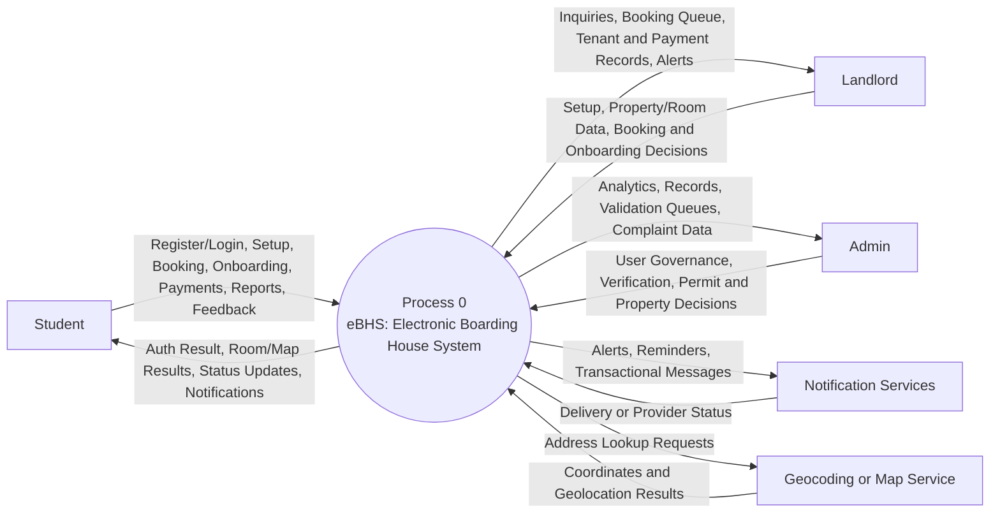
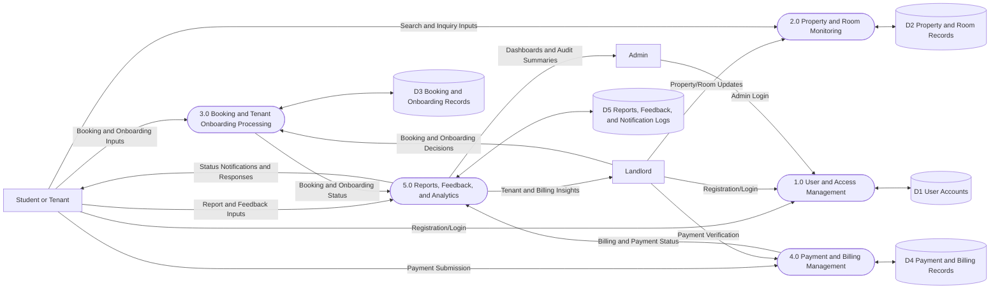

# Capstone Revisions

## Revised Software Requirements (Thesis Version)

### Purpose
This section defines the baseline and target software environment for developing, testing, and deploying the Maian Online Boarding House System (OBHS), built on Laravel 12, MySQL, and Vite.

### Software Requirements Matrix

| Component | Minimum Requirement (Baseline) | Recommended Requirement (Target) | Rationale |
|---|---|---|---|
| Operating System | Windows 10 64-bit (22H2) | Windows 11 64-bit (latest stable updates) | Supports modern PHP, Node.js, and MySQL toolchains required by Laravel 12 workflows. |
| Local Server Stack | Laragon 6.x or XAMPP (latest stable) with Apache 2.4+ | Laragon 6.x (latest stable) with PHP version switching enabled | Provides integrated local web server, PHP runtime, and MySQL services for development. |
| PHP Runtime | PHP 8.2.x | PHP 8.3.x | Laravel 12 requires PHP 8.2 or higher; 8.3 offers improved performance and longer support window. |
| Dependency Manager | Composer 2.5+ | Composer 2.7+ (latest stable) | Required for Laravel package installation, autoloading, and dependency security updates. |
| JavaScript Runtime | Node.js 18 LTS | Node.js 20 LTS | Required for Vite asset compilation; LTS versions ensure build stability. |
| Package Manager | npm 9+ | npm 10+ | Supports modern frontend dependency management and reproducible build scripts. |
| Database Engine | MySQL 8.0+ | MySQL 8.4 LTS | Supports relational schema features and stable transactional behavior for bookings, onboarding, and payments. |
| Database Client Tools | mysql and mysqldump binaries compatible with running MySQL version | Matching MySQL client binaries from same distribution (e.g., Laragon MySQL 8.x) | Prevents import/export and authentication plugin mismatch errors during backup and restore operations. |
| Web Browser | Edge or Chrome (latest stable) | Edge, Chrome, and Firefox (latest stable) | Ensures compatibility testing across major rendering engines for role-based web interfaces. |
| Code Editor / IDE | Visual Studio Code 1.85+ | Visual Studio Code (latest stable) with PHP, Blade, and Laravel extensions | Improves code quality, diagnostics, and development productivity. |
| Version Control | Git 2.40+ | Git latest stable | Required for source control, collaboration, and release traceability. |

### Software Configuration Standards

1. PHP extensions required for Laravel must be enabled, including `openssl`, `mbstring`, `pdo_mysql`, `tokenizer`, `xml`, `ctype`, and `json`.
2. The database character set should use `utf8mb4` with `utf8mb4_unicode_ci` collation for consistent multilingual text handling.
3. Environment variables must be configured via `.env` for database credentials, mail settings, queue behavior, and application keys.
4. Frontend assets must be built and served through Vite (`npm run dev` for development, `npm run build` for production).
5. Queue-related features should run with a worker process (`php artisan queue:listen` or `php artisan queue:work`) for notifications and asynchronous tasks.

### Validation and Compatibility Criteria

The software environment is considered acceptable for capstone deployment when all of the following are satisfied:

1. Application boots successfully via `php artisan serve` without runtime dependency errors.
2. Database migrations execute successfully via `php artisan migrate`.
3. Frontend assets compile successfully via Vite.
4. Core user workflows (student, landlord, admin) execute without browser compatibility issues.
5. Backup/restore commands and database import/export workflows execute using compatible MySQL client binaries.

### Final Recommended Baseline for Defense and Deployment

For stable demonstration and deployment, the project should standardize on:

- Windows 11 64-bit
- Laragon 6.x
- PHP 8.3.x
- Composer 2.7+
- Node.js 20 LTS with npm 10+
- MySQL 8.4 LTS
- Latest stable Edge/Chrome/Firefox
- Visual Studio Code latest stable
- Git latest stable

## Updated Use Case Diagram (Text-Based)

### System Boundary
Maian Online Boarding House System (OBHS)

### Actors
1. Student
2. Landlord
3. Admin

### Actor-Use Case Mapping

#### Student
1. Register/Login/Verify Account
2. Complete Student Setup
3. Manage Profile
4. Browse Rooms (List and Map)
5. View Room Details
6. Send Inquiry to Landlord
7. Submit Booking Request
8. Cancel Booking Request
9. Complete Tenant Onboarding (upload documents, sign contract, pay deposit)
10. Submit Monthly Payment
11. Submit Leave Request
12. Submit Room Feedback
13. Submit Report/Complaint
14. View Notifications
15. Use Role-Scoped Chatbot

#### Landlord
1. Register/Login/Verify Account
2. Complete Landlord Setup
3. Manage Properties
4. Manage Rooms
5. Review Booking Requests (approve/reject)
6. Manage Tenants
7. Manage Maintenance Status
8. Manage Monthly Payments (mark paid/pending, send reminders)
9. Review Tenant Onboarding (review documents, sign contract, approve onboarding)
10. Review and Decide Leave Requests
11. Review Feedback and Sentiment Results
12. Message Students
13. View Notifications
14. Use Role-Scoped Chatbot

#### Admin
1. Login and Access Admin Dashboard
2. Manage Users (students, landlords, admins)
3. Validate Student Verification Submissions
4. Validate/Approve Landlord Permits
5. Approve/Reject Properties
6. Monitor Bookings and Boarded Students
7. Monitor Tenant Onboarding Status
8. Review/Resolve Reports and Complaints
9. Send System Notifications and Messages
10. View Platform Statistics and Analytics
11. Use Role-Scoped Chatbot

### PlantUML Script (Copy-Paste Ready)

```plantuml
@startuml
left to right direction
skinparam packageStyle rectangle

actor Student
actor Landlord
actor Admin

rectangle "Maian Online Boarding House System" {
  (Register/Login/Verify Account) as UC1

  (Complete Student Setup) as UC2
  (Manage Student Profile) as UC3
  (Browse Rooms and Map) as UC4
  (View Room Details) as UC5
  (Send Inquiry) as UC6
  (Submit Booking Request) as UC7
  (Cancel Booking Request) as UC8
  (Complete Tenant Onboarding) as UC9
  (Submit Monthly Payment) as UC10
  (Submit Leave Request) as UC11
  (Submit Room Feedback) as UC12
  (Submit Report/Complaint) as UC13
  (View Notifications) as UC14

  (Complete Landlord Setup) as UC15
  (Manage Properties) as UC16
  (Manage Rooms) as UC17
  (Review Booking Requests) as UC18
  (Manage Tenants) as UC19
  (Manage Maintenance) as UC20
  (Manage Monthly Billing) as UC21
  (Review Tenant Onboarding) as UC22
  (Handle Leave Requests) as UC23
  (Review Feedback/Sentiment) as UC24
  (Message Students) as UC25

  (Manage Users) as UC26
  (Validate Student Verification) as UC27
  (Validate Landlord Permits) as UC28
  (Approve/Reject Properties) as UC29
  (Monitor Bookings and Boarded Students) as UC30
  (Monitor Tenant Onboarding) as UC31
  (Resolve Reports/Complaints) as UC32
  (Send System Notifications) as UC33
  (View Dashboard Analytics) as UC34

  (Use Role-Scoped Chatbot) as UC35
}

Student -- UC1
Student -- UC2
Student -- UC3
Student -- UC4
Student -- UC5
Student -- UC6
Student -- UC7
Student -- UC8
Student -- UC9
Student -- UC10
Student -- UC11
Student -- UC12
Student -- UC13
Student -- UC14
Student -- UC35

Landlord -- UC1
Landlord -- UC15
Landlord -- UC16
Landlord -- UC17
Landlord -- UC18
Landlord -- UC19
Landlord -- UC20
Landlord -- UC21
Landlord -- UC22
Landlord -- UC23
Landlord -- UC24
Landlord -- UC25
Landlord -- UC14
Landlord -- UC35

Admin -- UC1
Admin -- UC26
Admin -- UC27
Admin -- UC28
Admin -- UC29
Admin -- UC30
Admin -- UC31
Admin -- UC32
Admin -- UC33
Admin -- UC34
Admin -- UC14
Admin -- UC35

UC7 .> UC5 : <<include>>
UC9 .> UC7 : <<extend>>
UC21 .> UC18 : <<include>>
UC31 .> UC30 : <<include>>

@enduml
```

### Instructions to Build the Final Diagram

1. Use three actors only: Student (right), Landlord (left-top), Admin (left-bottom), matching your preferred layout.
2. Draw one system boundary rectangle titled "Maian Online Boarding House System".
3. Place use cases inside the boundary and group them by role area for readability.
4. Keep only major include/extend links to avoid clutter:
	- Submit Booking Request <<include>> View Room Details
	- Complete Tenant Onboarding <<extend>> Submit Booking Request
	- Manage Monthly Billing <<include>> Review Booking Requests
5. Connect each actor only to the use cases they actually perform in the implemented system.
6. If the diagram is too dense for one page, split into three diagrams:
	- Student Use Case Diagram
	- Landlord Use Case Diagram
	- Admin Use Case Diagram
7. For the thesis figure caption, use:
	"Figure X. Updated Use Case Diagram of Maian Online Boarding House System (OBHS)."

### Suggested Tools

1. diagrams.net (draw.io) for manual UML drawing
2. PlantUML using the script above for fast generation
3. StarUML or Visual Paradigm if your panel requires strict UML notation

## Activity Diagram Step-by-Step Process (Setup and Onboarding)

### 1) Student Setup Activity Flow

Suggested swimlanes: Student, System

1. Start.
2. Student logs in and opens Student Setup page.
3. System checks if student setup is already complete.
4. Decision: Setup complete?
  - Yes: System redirects to Student Dashboard. End.
  - No: System displays setup checklist and form.
5. Student fills in profile, academic, emergency, and parent or guardian details.
6. Student uploads required files.
7. System validates submitted fields and file rules.
8. Decision: Is input valid?
  - No: System returns validation errors and setup form. Go back to Step 5.
  - Yes: Continue.
9. System stores uploaded files and updates student record.
10. Decision: Was verification file updated?
  - Yes: System sets school_id_verification_status to pending.
  - No: Keep existing verification status.
11. System saves all setup data.
12. System redirects to Student Dashboard with success message.
13. End.

Notes for decision nodes:
- First-year students require COR or COE.
- Second year and above require Student ID and School ID photo.

### 2) Landlord Setup Activity Flow

Suggested swimlanes: Landlord, System, Admin

1. Start.
2. Landlord logs in and opens Landlord Setup page.
3. System builds setup snapshot and determines first incomplete step.
4. System displays setup steps: Profile, Permit, Billing.
5. Landlord submits setup form (profile details, permit file, payment methods).
6. System validates all required fields and conditional billing requirements.
7. Decision: Is input valid?
  - No: System returns errors and setup form. Go back to Step 5.
  - Yes: Continue.
8. System saves user profile and landlord profile data.
9. Decision: Business permit uploaded?
  - Yes: System sets business_permit_status to pending.
  - No: Status remains not_submitted.
10. System computes profile_complete, billing_methods_complete, and setup_submitted.
11. Decision: setup_submitted true?
  - No: System keeps landlord in setup flow. End.
  - Yes: System allows dashboard access while permit may still be pending.
12. When landlord opens operational pages, middleware checks gates:
  - profile_complete
  - permit_submitted
  - permit_approved
13. Decision: Gate passed?
  - No: System redirects to corresponding setup step with error message.
  - Yes: Landlord can use full operations.
14. Admin reviews business permit.
15. Decision: Permit approved?
  - Yes: Full landlord operations remain unlocked.
  - No (rejected): Landlord must re-upload permit; process loops to setup update.
16. End.

### 3) Tenant Onboarding Activity Flow (After Booking Approval)

Suggested swimlanes: Student, Landlord, System

1. Start.
2. Landlord approves booking request.
3. System marks booking as approved and creates Tenant Onboarding record (status pending).
4. Student opens Onboarding page.
5. Student uploads required onboarding documents.
6. System validates document count and file types.
7. Decision: Documents valid?
  - No: System returns errors. Go back to Step 5.
  - Yes: System sets status to documents_uploaded and notifies landlord.
8. Student signs contract.
9. Decision: Current status is documents_uploaded?
  - No: System blocks signing and shows error.
  - Yes: System stores signature, sets status to contract_signed, and notifies landlord.
10. Student submits onboarding payment (selected method, proof, reference as required).
11. Decision: Current status is contract_signed?
  - No: System blocks payment and shows error.
  - Yes: Continue.
12. System validates payment method and required proof or reference.
13. Decision: Payment submission valid?
  - No: System returns errors. Go back to Step 10.
  - Yes: System sets status to deposit_paid and notifies landlord for review.
14. Landlord reviews onboarding and payment.
15. Decision: Landlord action?
  - Approve payment:
    1. System sets deposit_paid true.
    2. System updates booking payment status to paid.
    3. System completes onboarding, generates digital ID, sets status to completed.
    4. System notifies student.
  - Reject payment:
    1. System clears payment fields.
    2. System reverts onboarding status to contract_signed.
    3. System notifies student to resubmit payment.
16. End.

### 4) Quick Drawing Guide for Your Activity Diagram

1. Use one initial node and one final node per diagram.
2. Use rounded rectangles for actions and diamonds for decisions.
3. Label decision branches clearly as Yes or No.
4. Show loop-back arrows for invalid input paths.
5. Keep three separate diagrams for readability:
  - Student Setup Activity Diagram
  - Landlord Setup Activity Diagram
  - Tenant Onboarding Activity Diagram
6. Put notification actions under the System swimlane to show automation.

## Updated Context Diagram (Level 0 DFD) for eBHS

### System Process (Single Process)
Process 0: Electronic Boarding House System (eBHS) / Maian Online Boarding House System

### External Entities
1. Student
2. Landlord
3. Admin
4. Notification Services (Email/SMS/In-App Push)
5. Geocoding or Map Service (for map-based browsing)

### Context-Level Data Flows

1. Student -> eBHS
  - Account registration and login credentials
  - Student setup details and verification files
  - Room search filters, booking requests, inquiries
  - Onboarding submissions (documents, contract signature, payment proof)
  - Monthly payment submissions, leave requests, reports, and feedback

2. eBHS -> Student
  - Authentication result and account status
  - Room listings, room details, map results
  - Booking and onboarding status updates
  - Payment history, reminders, system notifications, chatbot responses

3. Landlord -> eBHS
  - Landlord profile and business permit submission
  - Property and room management data
  - Booking decisions (approve or reject)
  - Onboarding review decisions, payment verification, leave request decisions

4. eBHS -> Landlord
  - Student inquiries and booking requests
  - Tenant onboarding and payment submissions for review
  - Tenant management records, sentiment summaries, reports, notifications

5. Admin -> eBHS
  - User management actions
  - Student verification and landlord permit decisions
  - Property approval decisions
  - Report resolution actions and system-level announcements

6. eBHS -> Admin
  - Platform analytics and dashboard metrics
  - User, booking, onboarding, payment, and report records
  - Validation queues and compliance monitoring views

7. eBHS <-> Notification Services
  - Outbound: alerts, reminders, and transactional notifications
  - Inbound: delivery feedback or provider status

8. eBHS <-> Geocoding or Map Service
  - Outbound: address or coordinate lookup requests
  - Inbound: map coordinates and geolocation results

### Mermaid Script (Copy-Paste Ready)

### Instructions for Your Final Figure

1. Keep only one process bubble in the middle: Process 0 (eBHS).
2. Place Student, Landlord, and Admin as primary external entities.
3. Add Notification Services and Geocoding or Map Service only if your panel allows external technical services in context diagrams.
4. Label each arrow using noun-based data flow labels (for example, Booking Request, Onboarding Status, Payment Submission).
5. Do not show internal modules (Bookings, Payments, Reports tables) in this level; reserve those for Level 1 DFD.
6. For your thesis caption, use:
  Figure X. Context Diagram (Level 0 DFD) of the Electronic Boarding House System (eBHS).

## Diagram 0 (DFD Level 1) for eBHMS: Online Boarding House Monitoring System

### Overview
This section presents Diagram 0 of the eBHMS project. The diagram shows the internal processes of the system, related data stores, external entities, and the major data flows among them. It explains how eBHMS receives inputs from users, validates and stores transactions, and returns operational and monitoring outputs.

### External Entities
1. Student or Tenant
2. Landlord
3. Admin

### Internal Processes
1.0 User and Access Management
2.0 Property and Room Monitoring
3.0 Booking and Tenant Onboarding Processing
4.0 Payment and Billing Management
5.0 Reports, Feedback, and Analytics

### Data Stores
1. D1: User Accounts
2. D2: Property and Room Records
3. D3: Booking and Onboarding Records
4. D4: Payment and Billing Records
5. D5: Reports, Feedback, and Notification Logs

### Diagram 0 Flow Description (Template-Style Narrative)

This diagram illustrates how the eBHMS system sequentially handles data and returns actionable information to students, landlords, and administrators through five core functional modules.

The process starts with the 1.0 User and Access Management module, which receives registration and login credentials from Student, Landlord, and Admin users. The module validates these details against the D1 User Accounts data store and returns authenticated session access and role-based permissions.

Next, the 2.0 Property and Room Monitoring module accepts property and room updates from Landlords and room search requests from Students. The module stores and retrieves listing details, room availability, occupancy limits, and monitoring status using the D2 Property and Room Records data store.

The core tenancy workflow is handled by the 3.0 Booking and Tenant Onboarding Processing module. It receives booking requests from Students, booking decisions from Landlords, and governance checks from Admin when needed. The module reads user and listing data, validates booking constraints, and records onboarding stages (documents, contract, deposit workflow) in D3 Booking and Onboarding Records.

After onboarding progression, the 4.0 Payment and Billing Management module processes monthly payment submissions from Students and verification actions from Landlords. It stores billing cycles, payment proofs, due dates, and payment decisions in D4 Payment and Billing Records, then returns payment status updates and reminders to relevant users.

Finally, the 5.0 Reports, Feedback, and Analytics module consolidates operational data from D3, D4, and D5 to provide monitoring outputs. This module produces dashboard indicators and summaries for Admin and Landlord users, while exposing status notifications, feedback outcomes, and report responses to Students.

### Suggested Data Flows per Process

1. Student or Tenant -> 1.0: Registration Data, Login Credentials
2. Landlord -> 1.0: Registration Data, Login Credentials
3. Admin -> 1.0: Login Credentials, Governance Commands
4. 1.0 <-> D1: Account Profile Data, Credential Validation

5. Landlord -> 2.0: Property and Room Details, Availability Updates
6. Student or Tenant -> 2.0: Search Filters, Room Inquiry Inputs
7. 2.0 <-> D2: Listings, Availability, Occupancy Data

8. Student or Tenant -> 3.0: Booking Request, Onboarding Submissions
9. Landlord -> 3.0: Booking Approval or Rejection, Onboarding Review Decisions
10. 3.0 <-> D3: Booking Status, Onboarding Stage Records

11. Student or Tenant -> 4.0: Payment Submission, Proof, Reference Data
12. Landlord -> 4.0: Payment Verification Decision
13. 4.0 <-> D4: Billing Entries, Payment Status History

14. Student or Tenant -> 5.0: Reports and Feedback Entries
15. 5.0 <-> D5: Complaint Records, Feedback Results, Notification Logs
16. 5.0 -> Admin: Monitoring Dashboards, Analytics, Audit Summaries
17. 5.0 -> Landlord: Tenant Monitoring Summaries, Billing and Feedback Insights
18. 5.0 -> Student or Tenant: Report Responses, Status Notifications

### Mermaid Script (Diagram 0 Draft)

### Figure Caption Suggestion
Figure X. Diagram 0 (DFD Level 1) of eBHMS: Online Boarding House Monitoring System.
